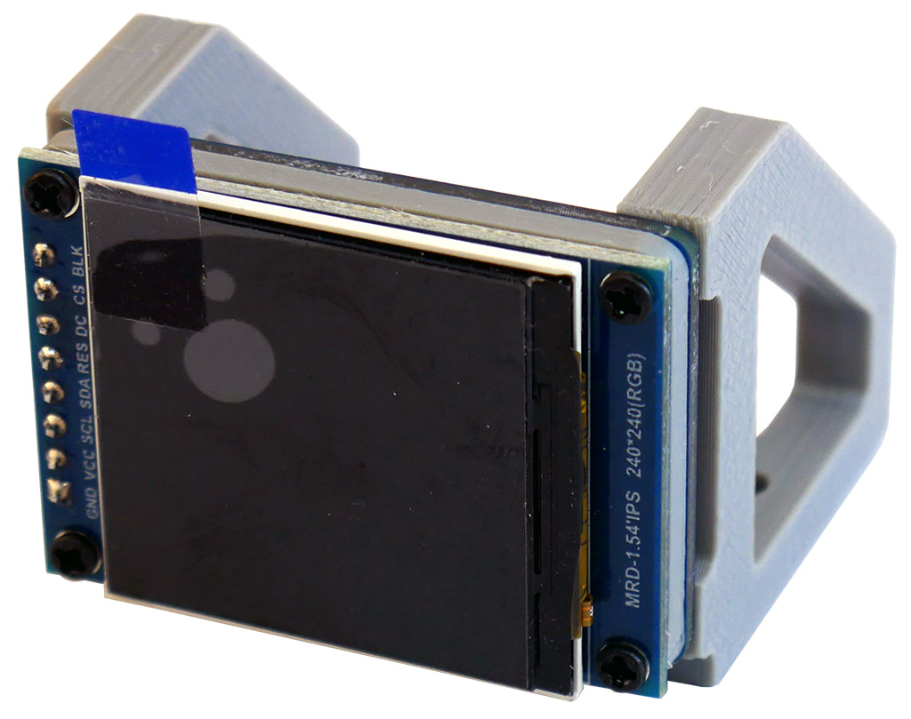

TFT LCD Breakout
================

Copyright 2021 SuperHouse Automation Pty Ltd  www.superhouse.tv

Designed to work with the Rack32 as a display for [Open eXtensible Rack System](https://oxrs.io/) 
home automation projects. This breakout combines a 1.54″ 240×240 TFT 
colour LCD, a 3D-printed spacer, a converter PCB with an IDC socket, 
and 3D-printed mounting brackets.

The mounting brackets allow it to be mounted in a 1U rack case, with 
screws through the bottom of the case and the display visible through 
the front panel with no visible fixtures. The design files for the 
mounting brackets are also provided so you can adjust the design if 
you want a different mounting arrangement.

Features:

 * 1.54" colour LCD
 * 240×240 resolution
 * SPI interface including CS (chip select) pin so it can share the bus with other devices

More information:

  [www.superhouse.tv/tftbr](http://www.superhouse.tv/tftbr)

INSTALLATION
------------
The design is saved as an EAGLE project. EAGLE PCB design software is
available from www.cadsoftusa.com free for non-commercial use. To use
this project download it and place the directory containing these files
into the "eagle" directory on your computer. Then open EAGLE and
navigate to the project.

CREDITS
-------
Designed by Jonathan Oxer jon@oxer.com.au

DISTRIBUTION
------------
The specific terms of distribution of this project are governed by the
license referenced below.

LICENSE
-------
Licensed under the TAPR Open Hardware License (www.tapr.org/OHL).
The "license" folder within this repository also contains a copy of
this license in plain text format.
